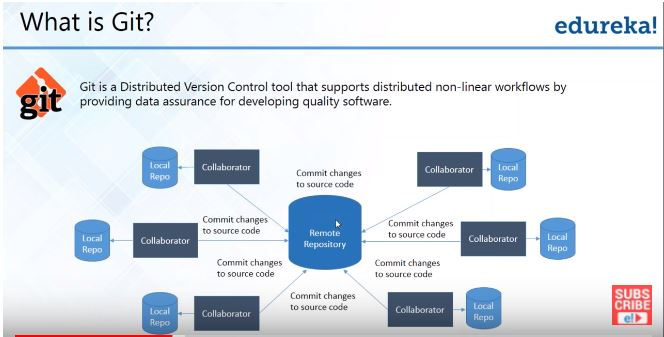
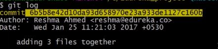

## Git and Github

#### Definition

#### Distributed Version Control System -  

  

Advantages of DVCS-

* Backup
* Access to files without a network
* Fetching to workspace is no problem

#### Git Commands and Operations

* Create Repo
  * **git init** - Initialize git local repository. This will      create a .git folder with all the necessary objects.
* Sync Repo  
 

   * **git remote add origin ["repository_link"]** - syncs local repository with central repository.
   * **git pull origin master** - pulls the content of central repo to the local repo.

   (_faced issues first time_: fatal error - protocol 'https' not supported. restarting the bash worked)
   * **git push** -

* Making Changes
  * **git status** - used to view and keep track of indexed/staged and non-staged files. Also keeps track of modified files.
  * **git add** - stages the files selected in the index for commit.
 Options -
    * (-A for commiting all files)
  * **git commit** - commiting files into the local repo. Cannot commit without message
 Options -
    * -a for commiting all files
    * -m for message
  * **git log** - log of all commands and Operations  
   

* Parallel Development  
 Branches are pointers to a specific commit. Branches are of 2 types - local and remote

   * **git branch [branch_name]** (while in master) - This will create a new branch from master named branch_name
