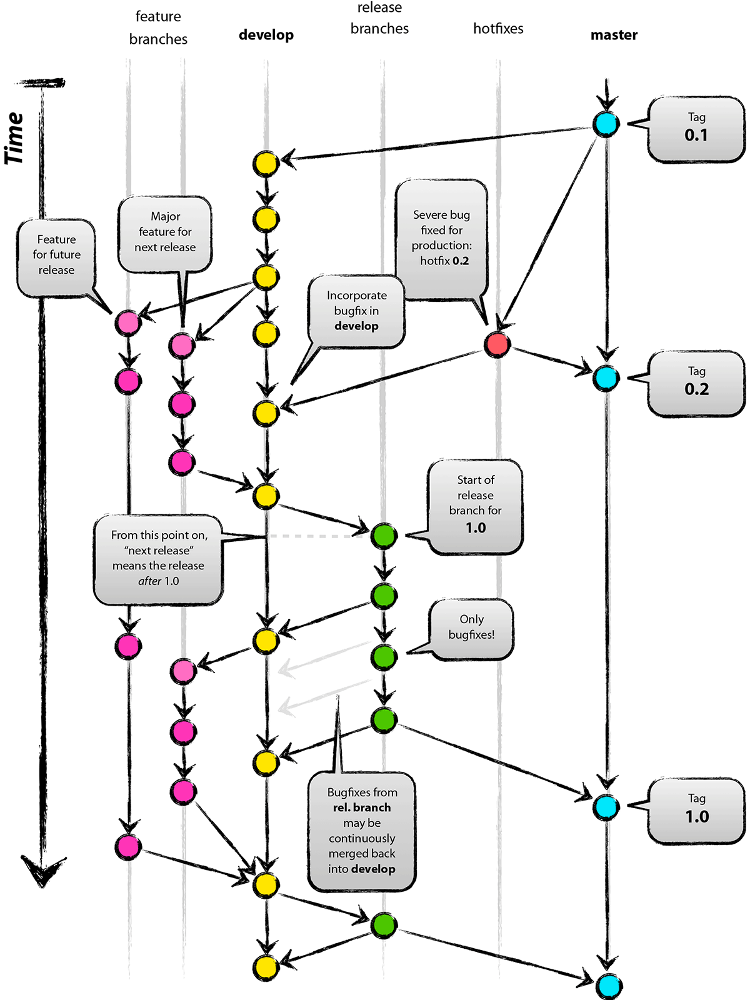

# Description: Project Diary for TRAINING

### [08-July-2019 - Day 01]
* Set-up
   - Ubuntu 16.04
   - Access to perfios-training
   - SSH Keys
       - <name>-ssh-key
       - <name>-gitlab-ssh-key
       - <name>-github-ssh-key
   - Setup Github access
   - Setup Gitlab access
   - Git
       - Install git
       - git config
   - Clone Repository
       - perfios-training
       - DeveloperNotes2Myself
       - UnixNotes2Myself
   - Install IntelliJ IDEA
       - Python Community Edition
       - Bash
       - Markdown

   - Setup IntelliJ Project
       - Create Project named IdeaProject
       - Add the three cloned repository

### [09-July-2019 - Day 02]  

  * Git Commands
      - add - stages the files selected in the index for commit.
      - checkout - can be used to checkout to another branch.
      - clone - Clones remote repo to local repo
      - commit - commiting files into the local repo. Cannot commit without message.
      - config - It is a convenience function that is used to set Git configuration values on a global or local project level. 
      - gitignore - When deciding whether to ignore a path, Git normally checks gitignore patterns from multiple sources
      - gitk - gitk is a graphical history viewer. Think of it like a powerful GUI shell over git log and git grep.
      - init - initialize a git repository
      - log - log of all commands and Operations
      - merge - Git merge will combine multiple sequences of commits into one unified history. In the most frequent use cases, git merge is used to combine two branches
      - pull - pulls the content of central repo to the local repo.
      - push - Pushing files from local to remote repository
      - remote - With no arguments, shows a list of existing remotes. 
      - stash - The command saves your local modifications away and reverts the working directory to match the HEAD commit.
      - status - status of current branch
      
  * Best practices (Before pushing changes to remote aniruddha)
  ```
  git checkout develop          # from local aniruddha to local develop
  git branch -a                 # to view all branches present locally and remotely
  git fetch origin              # git pull origin (remote develop) can be used for 
  git merge origin              # these 2 steps
  git checkout aniruddha        # local aniruddha
  git merge develop             # with local branch develop
  git status
  git push origin aniruddha     # remote aniruddha

  ```
  * Git Topics
      - Create account on Gitlab
      - Create account on Github
      - Setup SSH access to Gitlab
      
        **ssh-keygen -t rsa -b 4096** - generates ssh Keys
        
      - Setup SSH access to Github
      - Use of Markdown in GitLab and GitHub
      - Setting up Meld
        *  Install MELD diff tool using the command  
          ``` sudo apt-get install meld   ``` 
        * Change execute permissions for script 
        * Set the Git External Diff Tool to this script  
          ```  git config --global diff.external <PATH_TO_THE_SCRIPT> ```
        * Use command to see visual differences  
          ``` git diff aniruddha --stat```         
      - Creating Merge Requests in Gitlab
      - Understanding Code Review in Gitlab
      - Perfios Git Model
        
        Dictator and Lieutenants Workflow  
        This is a variant of a multiple-repository workflow.   
        It’s generally used by huge projects with hundreds of collaborators;   
        one famous example is the Linux kernel. Various integration managers are in charge of certain parts of the repository;   
        they’re called lieutenants. All the lieutenants have one integration manager known as the benevolent dictator.   
        The benevolent dictator pushes from his directory to a reference repository from which all the collaborators need to pull.   
        The process works like this (see Benevolent dictator workflow.):  

        1. Regular developers work on their topic branch and rebase their work on top of master. The master branch is that of the reference repository to which the dictator pushes.
        
        2. Lieutenants merge the developers' topic branches into their master branch.
        
        3. The dictator merges the lieutenants' master branches into the dictator’s master branch.
        
        4. Finally, the dictator pushes that master branch to the reference repository so the other developers can rebase on it.
        
        
        
        Detailed Workflow Model  
        
        
        
        This kind of workflow isn’t common, but can be useful in very big projects, or in   
        highly hierarchical environments. It allows the project leader (the dictator) to 
        delegate much of the work and collect large subsets of code at multiple points   
        before integrating them.
        
      - Git Internals
      - Git Commands Flow
        
  * Discussion on Git task

### [10-July-2019 - Day 03]

  * Unix Reference
        - [Unix Commands Reference](https://github.com/vikash-india/UnixNotes2Myself/tree/develop/linux/commands)
  *  Unix Commands
  ```
       - apg         : Advanced Password Generator
       - apropos     : Relevant manual pages and descriptions
       - alias       : abbreviates a regularly used command
       - apt         : Advanced Package Tool
       - apt-get     : Superset of apt
       - atop        : open source tool to monitor system and processes and log its history
       - bc          : basic calculator
       - basename    : strips directory and suffix from filenames
       - cal         : calendar
       - cat         : concatenate
       - cd          : change directory
       - chmod       : change file mode bits
       - chown       : change file ownership and group
       - chattr      : change file attributes
       - cksum       : compute checksum and count the bytes in a file.
       - clear       : clears the screen
       - comm        : compares two sorted files line by line
       - compgen     : used when a command completion is required in a script
       - cron        : daemon to execute scheduled commands
       - cp          : copies the files and directories
       - curl        : used to transfer a URL
       - cut         : removes sections from each line of files.
       - df          : disk usage
       - diff        : compares files line by line
       - dig         : domain information groper; used for interrogating DNS name servers
       - dirname     : strips last component from filename
       - dirs        : lists current directory stack (path)
       - dpkg        : package manager for Debian
       - echo        : prints output; displays line of text
       - env         : runs a program in a modified environment
       - expand      : converts tabs to spaces
       - false       : does nothing, unsuccessfully
       - fdisk       : used to manipulate disk partition table
       - file        : determines the filetype of a file
       - find        : searches for files in a directory hierarchy
       - free        : displays the amount of free and used memory in the system (RAM)
       - grep        : prints line matching a pattern
       - head        : outputs the first part of the files
       - history     : shows the history of commands used
       - mv          : moves or renames files
       - man         : provides reference manuals
       - ls          : lists file parameters. fields in -l option.  
                     1st column is file type(d for DIR, - for Files, l for links) and access details for UGO (User Group Others aka file permission).                    
                     2nd column is Number of links (2,1), the number of names there are for the file. Generally an ordinary file will only have one link, but a directory will have more, because you can refer to it as ``dirname'', ``dirname/.'' where the dot means ``current directory'', and if it has a subdirectory named ``subdir'', ``dirname/subdir/..'' (the ``..'' means ``parent directory'').                     
                     3rd Column is File/directory owner (root) 
                     4th Column is File/directory group (root)                   
                     5th Column is Size of the file and Dir (41, 3072)
                     6th Column is Date the file / DIR created. ( Jan 14  2013)  
                     7th Column is File Directory name (archive, bin)
       - wc         : prints newline, word, and byte counts for each file.
       - whoami     : prints effective (current) userid
       - who        : shows who is logged on
       - xclip      : copies content to clipboard
       - wget       : non-interactive network downloader
       
   ```
   * Unix Topics
        - Unix Commands
        - Understanding SSH Setup
        - Understanding .bashrc  
        
          .bashrc is a shell script that Bash runs whenever it is started interactively.   
          It initializes an interactive shell session. You can put any command in that file that   
          you could type at the command prompt.
          
          You put commands here to set up the shell for use in your particular environment,   
          or to customize things to your preferences. A common thing to put in .bashrc are aliases   
          that you want to always be available.
        - Unix Filesystem
        
          
          
        - File Permissions and Ownerships
          
                      ╔════════╦════════╦═══════╦═════════════════════════════════╗
                      ║ String ║ Binary ║ Octal ║           Description           ║
                      ╠════════╬════════╬═══════╬═════════════════════════════════╣
                      ║ ---    ║    000 ║     0 ║ No Read + No Write + No Execute ║
                      ║ --x    ║    001 ║     1 ║ Execute                         ║
                      ║ -w-    ║    010 ║     2 ║ Write                           ║
                      ║ -wx    ║    011 ║     3 ║ Write + Execute                 ║
                      ║ r--    ║    100 ║     4 ║ Read                            ║
                      ║ r-x    ║    101 ║     5 ║ Read + Execute                  ║
                      ║ rw-    ║    110 ║     6 ║ Read + Write                    ║
                      ║ rwx    ║    111 ║     7 ║ Read + Write + Execute          ║
                      ╚════════╩════════╩═══════╩═════════════════════════════════╝
          
        - Unix Processes  
   * Discussion on Unix task
    
   ### [11-July-2019 - Day 04]
   
  * Bash Scripting
  * Mounting partition to sda1
  
  
    409  lsblk
    410  sudo fdisk /dev/sda
    411  lsblk
    412  sudo mkdir /data
    413  sudo mkfs -t ext4 /dev/sda1
    414  sudo vim /etc/fstab
    415  sudo mount -a
    416  lsblk
    
   ### [12-July-2019 - Day 05]
   - Shell Scripting
   - Mysql installation
   ```aidl
    sudo apt install mysql-server
   ```
   ### [15-July-2019 - Day 06]
   
   ##### Understanding htop Command
   
   Every Linux administrator and users have must come across the situation where the system has reached   
   its saturation point and it starts consuming all of the resources allocated to it. At this particular time,   
   we wholeheartedly want to identify the processes responsible for consuming such high resource usage.   
   To identify such processes, we have many tools and commands available nowadays, but the best among all is htop.  

      
   
   htop allows you to monitor processes running on the system along with their full command lines.    
   We can perform tasks related to processes (killing, renicing) without entering their PIDs.   
   Htop allows us to sort the processes on the basis of CPU, Memory and Time Interval. It also allows us to sort all the processes owned by a particular user.
   
   Meaning and explanation of each color:  
   >
   >**Blue**: Display percentage of CPU used by low priority processes.(nice > 0)  
   >**Green**: Displays percentage of CPU used for processes owned by normal users.  
   >**Red**: Displays percentage of CPU used by system processes.  
   >**Orange**: Displays percentage of CPU used by IRQ time.  
   >**Magenta**: Displays percentage of CPU consumed by Soft IRQ time.  
   >**Grey**: Displays percentage of CPU consumed by IO Wait time.  
   >**Cyan**: Displays percentage of CPU consumed by Steal time.  
   
   
   Detailed Processes Information in htop
   htop list - Understanding Output of htop Command
   
   >**PID** – It describes the Process ID number.  
   >**USER** - It describes the process owner.  
   >**PRI** – It describes the process priority as viewed by the Linux kernel.  
   >**N** – It describes the process priority reset by the user or root.  
   >**VIR** – It describes the virtual memory that a process is consuming.  
   >**RES** – It describes the physical memory that a process is consuming.  
   >**SHR** – It describes the shared memory that a process is consuming.  
   >**S** – It describes the current state of a process.  
   >**CPU%** – It describes the percentage of CPU consumed by each process.  
   >**MEM%** – It describes the percentage of Memory consumed by each process.  
   >**TIME+** – It displays the time since process execution has started.  
   >**Command** – It displays the full command execution in parallel to each process.  
   
   
   ##### MySQL Sample Database - Employee
   
   - A sample database **employee** is available on [GitHub](https://github.com/datacharmer/test_db)
   - Steps to load the employee database into a MySQL instance.
   ```
   git clone git@github.com:datacharmer/test_db.git
   cd test_tb
   mysql -hlocalhost -udb_user_name -p < employees.sql
   ```
   - Steps to verify the correctness of the imported database.
   ```
   mysql -hlocalhost -udb_user_name -p < test_employees_md5.sql;
   mysql -hlocalhost -udb_user_name -p < test_employees_sha.sql; # An alternative
   ```
   - Data Definition Language
   - Data Manipulation Language
   - Data Query Language

   ### [16-July-2019 - Day 07]
   
   ##### Continuing Mysql
   
   - Query Flow
   - Index - 
   
     Indexes are used to speed-up query process in SQL Server, resulting in high performance.   
     They are similar to textbook indexes. In textbooks, if you need to go to a particular   
     chapter, you go to the index, find the page number of the chapter and go directly to that page.   
     Without indexes, the process of finding your desired chapter would have been very slow.  
     
     The same applies to indexes in databases. Without indexes, a DBMS has to go through all the records   
     in the table in order to retrieve the desired results. This process is called table-scanning and is extremely slow.   
     On the other hand, if you create indexes, the database goes to that index first and then retrieves the corresponding table records directly.  
     
     There are two types of Indexes in SQL Server:
     
     
         1.Clustered Index  
    
         >A clustered index defines the order in which data is physically stored in a table. 
         Table data can be sorted in only way, therefore, there can be only one clustered index per table. In SQL Server, 
         the primary key constraint automatically creates a clustered index on that particular column.
       
       
         2.Non - clustered Index
         
         >A non-clustered index doesn’t sort the physical data inside the table. In fact, a non-clustered index is stored at one place and table data is stored   
         in another place. This is similar to a textbook where the book content is located in one place and the index is located in another. This allows for more   
         than one non-clustered index per table.
          
          It is important to mention here that inside the table the data will be sorted by a clustered index. However, inside the non-clustered index data is stored in the specified order. The index contains column values on which the index is created and the address of the record that the column value belongs to.
          

   
   - Query Optimization
   - Best Practices 
   
   Queries - 
   
   - From
   - Where
   - Group By
   - Having
   - Select
   - Distinct
   - Order By
   - Limit
   
   ##### Understanding EXPLAIN PLAN
   
   ```
   mysql> explain select count(*),avg(salary) from salaries as S,dept_emp as DEMP,titles as T where DEMP.emp_no=S.emp_no AND DEMP.emp_no=T.emp_no group by T.title,DEMP.dept_no\G;
   *************************** 1. row ***************************
              id: 1
     select_type: SIMPLE
           table: DEMP
      partitions: NULL
            type: index
   possible_keys: PRIMARY
             key: dept_no
         key_len: 4
             ref: NULL
            rows: 331570
        filtered: 100.00
           Extra: Using index; Using temporary; Using filesort
   *************************** 2. row ***************************
              id: 1
     select_type: SIMPLE
           table: T
      partitions: NULL
            type: ref
   possible_keys: PRIMARY
             key: PRIMARY
         key_len: 4
             ref: employees.DEMP.emp_no
            rows: 1
        filtered: 100.00
           Extra: Using index
   *************************** 3. row ***************************
              id: 1
     select_type: SIMPLE
           table: S
      partitions: NULL
            type: ref
   possible_keys: PRIMARY
             key: PRIMARY
         key_len: 4
             ref: employees.DEMP.emp_no
            rows: 9
        filtered: 100.00
           Extra: NULL
   3 rows in set, 1 warning (0.00 sec)
   ```
   
   ### [17-July-2019 - Day 08]
   
   #### Vim
   * Vim Reference
       - [Why Vim is One of the Best Editor](https://www.youtube.com/watch?v=CM7UP-un1vc)
       - [Why Should You Learn Vim](https://www.tecmint.com/reasons-to-learn-vi-vim-editor-in-linux/)
       - [Vim Reference](https://github.com/vikash-india/UnixNotes2Myself/tree/master/technologies/gvim/concepts)
   
   * Vim Topics
        - Vim Installation
        - Files Operations in Vim
        - Movement Commands in Vim
        - Editing Text in Vim
        - Buffers in Vim
        - Markers in Vim
        - Pattern Search in Vim
        - Pattern Substitutions in Vim
        - Regular Expressions in Vim
        - Abbreviations in Vim
        - Key Mappings in Vim
        - Executing Unix Commands in Vim
        - Vim Macros
   * Discussion on Vim Task
<<<<<<< HEAD
   
   ### [18-July-2019 - Day 09]
   
   #### Java
   * Java Reference
       - [None](#)
   * Java Topics
       - Getting Started with Java
           - Why Java?
           - Java Virtual Machine
           - Setting up Java
           - Commandline Samples
           - IDE
       - Java Fundamentals
           - Data Types
           - Control Structures
           - Classes and Objects
           - Static keyword
           - Methods
           - Interfaces
           - Exceptions
           - Oops
               - Inheritance
               - Polymorphism
               - Abstraction
               - Encapsulation
           - Generics
           - Collections
               - Hashing
               - Lists
               - Sets
               - Maps
               - Trees
           - IO
           - JDBC
       - Advanced
           - Garbage Collection
           - Jvm Internals
           - Cryptography
           - Java8
               - Lambdas
               - Streams
   * J2EE Topics
       - Servlet Specification API
       - JSP, JSF
       - Tomcat
       - Deploy sample web application
       - JDO, JPA, Hibernate
       - Dependency Injection
       - Security for J2EE
   * Java Tools
       - IDE tools
           - Sonarlint
           - Google style guide
           - Markdown navigator
           - Debugger
           - Maven
           - Static Analysis
   * Discussion on Java Task

  ### [19-July-2019 - Day 10]
   
=======


:%s/\s\+/,/g|:%s/$/\)/g|%s/^/insert into employees values \(/
>>>>>>> develop
